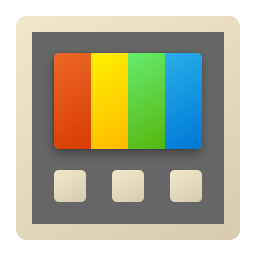

<!--
## Hi there 👋
**djairvinicius/djairvinicius** is a ✨ _special_ ✨ repository because its `README.md` (this file) appears on your GitHub profile.

Here are some ideas to get you started:

- 🔭 I’m currently working on ...
- 🌱 I’m currently learning ...
- 👯 I’m looking to collaborate on ...
- 🤔 I’m looking for help with ...
- 💬 Ask me about ...
- 📫 How to reach me: ...
- 😄 Pronouns: ...
- ⚡ Fun fact: ...
-->
<h1 align="center">
    Olá👋! Sou Djair Vinicius
</h1>

<h2 align="center">
Atualmente estudando HTML e CSS e posteriormente outras tecnologias de desenvolvimento WEB.
</h2>

<h3 align="left">Linguagens e ferramentas</h3>

 
<!--html5-->

<!--icon css-->

<!--vscode-->

<!--github-->
 
<!--icon git-->
 
<!--linux-->

<!--gimp-->

<!--microsoft-->

<!--powertoys-->
<a href="https://learn.microsoft.com/en-us/windows/powertoys/" target="_blank" rel="noreferrer">

<!--icon photoshop-->

<!--adobe premiere-->

<!--after-effects-->
 

